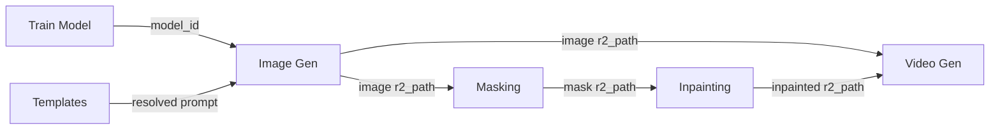

# Harden New Microservices as Composable Tools

Three new RunPod workers exist (`microservices/masking`, `microservices/inpainting`, `microservices/video-generation`) but have **no backend Flask services** wrapping them. Without these, an orchestrator/agent would need to call RunPod APIs directly, manage API keys, poll status, and download from R2 itself. We need to create backend services that follow the same pattern as `[backend/image-generation/](backend/image-generation/)`.

## Current State

- **Masking handler** -- well-hardened. Accepts `image_url`, `object_name`, `seed`, `mask_dilation`, `mask_blur`. Returns `images`, `params`, `duration_seconds`.
- **Inpainting handler** -- well-hardened. Accepts `scene_url`, `reference_url`, `prompt`, `seed`, `steps`, `denoise`, `guidance`. Returns `images`, `params`, `duration_seconds`.
- **Video-generation handler** -- mostly hardened. Accepts `image_url`, `prompt`, `width`, `height`, `length`, `steps`, `seed`. But `params` output only includes `prompt` and `seed` (missing `width`, `height`, `length`, `steps`).
- **No backend Flask services** exist for any of these three.

## What to Build

For each of the three services, create a backend Flask app following the `[backend/image-generation/](backend/image-generation/)` pattern:

```
backend/<service>/
  app.py          -- Flask app entry point
  routes.py       -- Blueprint with sync + async endpoints
  requirements.txt
  Dockerfile
  services/
    runpod.py     -- submit_job / get_job_status
    r2.py         -- download result from R2
    db.py         -- async job tracking table
  .env            -- RunPod API key + endpoint ID
```

### Ports

- Masking: `:5004`
- Inpainting: `:5005`
- Video Generation: `:5006`

---

## 1. Fix video-generation handler params

In `[microservices/video-generation/handler.py](microservices/video-generation/handler.py)`, the return `params` dict only has `prompt` and `seed`. Add `width`, `height`, `length`, `steps` to match the pattern of other handlers.

---

## 2. Backend: Masking Service (`:5004`)

### Endpoints

- **POST /api/mask** (sync) -- accepts `image_url`, `object_name`, `seed`, `mask_dilation`, `mask_blur`. Submits to RunPod, polls, downloads result mask from R2, returns `image_url` + metadata.
- **POST /api/mask/async** -- returns `job_id` immediately (202)
- **GET /api/mask/job_id** -- poll async status/result
- **GET /api/masks/filename** -- serve downloaded mask image

### RunPod submit payload

```python
job_input = {
    "image_url": image_url,
    "object_name": object_name,
    "seed": seed,
    "mask_dilation": mask_dilation,
    "mask_blur": mask_blur,
}
```

---

## 3. Backend: Inpainting Service (`:5005`)

### Endpoints

- **POST /api/inpaint** (sync) -- accepts `scene_url`, `reference_url`, `prompt`, `seed`, `steps`, `denoise`, `guidance`. Submits to RunPod, polls, downloads result, returns `image_url` + metadata.
- **POST /api/inpaint/async** -- returns `job_id` immediately (202)
- **GET /api/inpaint/job_id** -- poll async status/result
- **GET /api/inpainted/filename** -- serve downloaded image

### RunPod submit payload

```python
job_input = {
    "scene_url": scene_url,
    "reference_url": reference_url,
    "prompt": prompt,
    "seed": seed,
    "steps": steps,
    "denoise": denoise,
    "guidance": guidance,
}
```

---

## 4. Backend: Video Generation Service (`:5006`)

### Endpoints

- **POST /api/video** (sync) -- accepts `image_url`, `prompt`, `width`, `height`, `length`, `steps`, `seed`. Submits to RunPod, polls, downloads video, returns `video_url` + metadata.
- **POST /api/video/async** -- returns `job_id` immediately (202)
- **GET /api/video/job_id** -- poll async status/result
- **GET /api/videos/filename** -- serve downloaded video

### RunPod submit payload

```python
job_input = {
    "image_url": image_url,
    "prompt": prompt,
    "width": width,
    "height": height,
    "length": length,
    "steps": steps,
    "seed": seed,
}
```

---

## 5. Docker Compose

Add all three services to `[backend/docker-compose.yml](backend/docker-compose.yml)` with PG env vars and `.env` file references.

---

## 6. Update docs

Add the three new services to `[docs/harden-backend-plan.md](docs/harden-backend-plan.md)` with their endpoint tables, parameter specs, and the updated composable flow diagram.

---

## Composable Flow (updated)




Each service is independently callable. An agent can skip any step or compose them in any order.