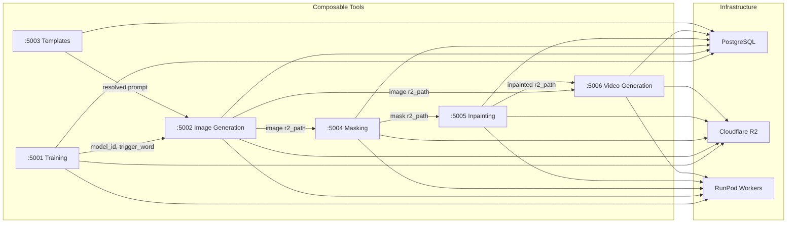
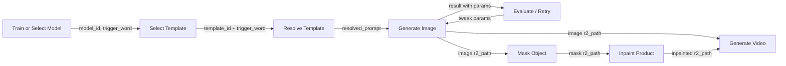

# Harden Backend Tools for Composability

Goal: make each service a fully controllable, self-contained tool. Every parameter is API-driven, every response carries enough context for any downstream step to consume without external lookups. The orchestrator (ADK or otherwise) comes later -- these tools must work in any combination.

## Status

| Task | Status |
|------|--------|
| Templates: GET by ID + resolve endpoint | COMPLETED |
| Training: GET model by ID + enriched status | COMPLETED |
| Image Gen: Expose seed, guidance_scale, negative_prompt | COMPLETED |
| Image Gen: Enrich response with full metadata | COMPLETED |
| RunPod handler: Wire through new params to ComfyUI | COMPLETED |
| Image Gen: Async mode (POST returns job_id, GET for status) | COMPLETED |
| Masking: Backend Flask service with sync + async endpoints | COMPLETED |
| Inpainting: Backend Flask service with sync + async endpoints | COMPLETED |
| Video Generation: Backend Flask service with sync + async endpoints | COMPLETED |
| Video handler: Return all params in output | COMPLETED |
| Docker Compose: Add masking, inpainting, video-generation | COMPLETED |

## Service Overview



---

## 1. Templates Service (`:5003`) -- `backend/templates/`

### Endpoints

- **GET /api/templates** -- List all templates
- **GET /api/templates/<template_id>** -- Get a single template by ID
- **POST /api/templates** -- Create a new template (multipart: name, prompt, image)
- **DELETE /api/templates/<template_id>** -- Delete a template
- **POST /api/templates/<template_id>/resolve** -- Resolve a template prompt

#### Resolve endpoint

Request: `{ "trigger_word": "TOK_HANDBAG" }`

Response:

```json
{
  "template_id": "uuid",
  "template_name": "Girl with product",
  "original_prompt": "...trigger_keyword...",
  "resolved_prompt": "...TOK_HANDBAG...",
  "trigger_word": "TOK_HANDBAG"
}
```

### Files

- `backend/templates/routes.py`
- `backend/templates/models/template.py`

---

## 2. Training Service (`:5001`) -- `backend/training/`

### Endpoints

- **GET /api/models** -- List all trained models
- **GET /api/models/<model_id>** -- Get a single model by database ID
- **GET /api/training-config** -- Get default training params (steps, lr, rank, etc.)
- **POST /api/train** -- Submit a training job (multipart: images zip, model_name, trigger_word, optional overrides for steps, lr, lora_rank, batch_size, resolution)
- **GET /api/training-status/<job_id>** -- Poll training progress

#### Enriched status response

Now returns `model_id`, `job_id`, `model_name`, `trigger_word`, `status`, and `model_string` (R2 path when complete).

### Files

- `backend/training/routes.py`
- `backend/training/models/trained_model.py`

---

## 3. Image Generation Service (`:5002`) -- `backend/image-generation/`

### Endpoints

- **POST /api/generate** -- Synchronous generation (blocks until complete)
- **POST /api/generate/async** -- Async generation (returns job_id immediately, HTTP 202)
- **GET /api/generate/<job_id>** -- Poll async job status and result
- **GET /api/images/<filename>** -- Serve a generated image file

### Parameters (all endpoints)

| Parameter | Type | Default | Notes |
|-----------|------|---------|-------|
| model_id | int | required | Database ID of the trained model |
| prompt | string | required | The generation prompt |
| lora_scale | float | 1.0 | LoRA strength for model and CLIP |
| num_inference_steps | int | 25 | Sampling steps |
| width | int | 1024 | Output width |
| height | int | 1024 | Output height |
| seed | int | random | For reproducible generations |
| guidance_scale | float | workflow default (1.0) | Prompt adherence (maps to ComfyUI cfg) |
| negative_prompt | string | workflow default | What to avoid in generation |

### Rich response

```json
{
  "success": true,
  "image_url": "/api/images/<filename>",
  "r2_path": "r2://test-ftp/generated/...",
  "model_id": 6,
  "prompt": "the actual prompt used",
  "generation_params": {
    "lora_scale": 1.0,
    "width": 1024,
    "height": 1024,
    "steps": 25,
    "seed": 12345,
    "guidance_scale": 1.0,
    "negative_prompt": "..."
  },
  "duration_seconds": 45.2
}
```

### Async flow

1. `POST /api/generate/async` → `{ "job_id": "uuid", "status": "pending" }` (202)
2. `GET /api/generate/<job_id>` → `{ "status": "processing", ... }` (poll)
3. `GET /api/generate/<job_id>` → `{ "status": "completed", "result": { ... } }` (done)

Jobs tracked in `generation_jobs` PostgreSQL table.

### Files

- `backend/image-generation/routes.py`
- `backend/image-generation/services/runpod.py`
- `backend/image-generation/services/db.py`
- `backend/image-generation/app.py`

---

## 4. RunPod Handler -- `microservices/image-generation/handler.py`

The handler accepts all generation params from the RunPod job input and wires them into the ComfyUI workflow:

- `seed` → KSampler node (falls back to random if not provided; actual seed always returned)
- `guidance_scale` → KSampler `cfg` input
- `negative_prompt` → negative CLIPTextEncode node text
- `steps`, `width`, `height`, `lora_scale` → existing wiring

The handler also returns enriched output: `images`, `params` (including actual seed used), and `duration_seconds`.

**Note:** Changes to this file require rebuilding and redeploying the RunPod worker Docker image.

---

## 5. Masking Service (`:5004`) -- `backend/masking/`

Uses Florence 2 + SAM2 to detect and segment an object in an image, producing a mask.

### Endpoints

- **POST /api/mask** -- Synchronous masking (blocks until complete)
- **POST /api/mask/async** -- Async masking (returns job_id immediately, HTTP 202)
- **GET /api/mask/<job_id>** -- Poll async job status and result
- **GET /api/masks/<filename>** -- Serve a generated mask image

### Parameters

| Parameter | Type | Default | Notes |
|-----------|------|---------|-------|
| image_url | string | required | Image to segment (r2:// or https://) |
| object_name | string | required | Object to detect and mask (e.g. "headphone", "shoe") |
| seed | int | random | For reproducible detection |
| mask_dilation | int | 50 | Pixels to expand the mask boundary |
| mask_blur | int | 50 | Amount of blur applied to mask edges |

### Rich response

```json
{
  "success": true,
  "image_url": "/api/masks/<filename>",
  "r2_path": "r2://bucket/masks/...",
  "object_name": "headphone",
  "masking_params": {
    "seed": 42,
    "mask_dilation": 50,
    "mask_blur": 50
  },
  "duration_seconds": 12.3
}
```

### Files

- `backend/masking/routes.py`
- `backend/masking/services/runpod.py`
- `backend/masking/services/r2.py`
- `backend/masking/services/db.py`
- `backend/masking/app.py`

---

## 6. Inpainting Service (`:5005`) -- `backend/inpainting/`

Uses Flux 2 Klein 9B to inpaint a product into a masked scene.

### Endpoints

- **POST /api/inpaint** -- Synchronous inpainting (blocks until complete)
- **POST /api/inpaint/async** -- Async inpainting (returns job_id immediately, HTTP 202)
- **GET /api/inpaint/<job_id>** -- Poll async job status and result
- **GET /api/inpainted/<filename>** -- Serve an inpainted image

### Parameters

| Parameter | Type | Default | Notes |
|-----------|------|---------|-------|
| scene_url | string | required | Masked scene image (mask in red channel), r2:// or https:// |
| reference_url | string | required | Product/reference image, r2:// or https:// |
| prompt | string | "product on a surface" | Text prompt for inpainting |
| seed | int | random | For reproducible generation |
| steps | int | 4 | Sampling steps |
| denoise | float | 1.0 | Denoising strength |
| guidance | float | 4.0 | Flux guidance scale |

### Rich response

```json
{
  "success": true,
  "image_url": "/api/inpainted/<filename>",
  "r2_path": "r2://bucket/generated/...",
  "inpainting_params": {
    "prompt": "product on a surface",
    "seed": 42,
    "steps": 4,
    "denoise": 1.0,
    "guidance": 4.0
  },
  "duration_seconds": 25.1
}
```

### Files

- `backend/inpainting/routes.py`
- `backend/inpainting/services/runpod.py`
- `backend/inpainting/services/r2.py`
- `backend/inpainting/services/db.py`
- `backend/inpainting/app.py`

---

## 7. Video Generation Service (`:5006`) -- `backend/video-generation/`

Image-to-video generation using Wan I2V via ComfyUI.

### Endpoints

- **POST /api/video** -- Synchronous video generation (blocks until complete)
- **POST /api/video/async** -- Async video generation (returns job_id immediately, HTTP 202)
- **GET /api/video/<job_id>** -- Poll async job status and result
- **GET /api/videos/<filename>** -- Serve a generated video

### Parameters

| Parameter | Type | Default | Notes |
|-----------|------|---------|-------|
| image_url | string | required | Source image for video, r2:// or https:// |
| prompt | string | default in worker | Motion/camera prompt |
| width | int | 832 | Video width |
| height | int | 480 | Video height |
| length | int | 33 | Number of frames |
| steps | int | 20 | Sampling steps |
| seed | int | random | For reproducible generation |

### Rich response

```json
{
  "success": true,
  "video_url": "/api/videos/<filename>",
  "r2_path": "r2://bucket/generated/...",
  "video_params": {
    "prompt": "camera slowly circles around...",
    "seed": 42,
    "width": 832,
    "height": 480,
    "length": 33,
    "steps": 20
  },
  "duration_seconds": 120.5
}
```

### Files

- `backend/video-generation/routes.py`
- `backend/video-generation/services/runpod.py`
- `backend/video-generation/services/r2.py`
- `backend/video-generation/services/db.py`
- `backend/video-generation/app.py`

---

## 8. RunPod Handlers -- `microservices/*/handler.py`

All RunPod handlers follow a consistent pattern:

- Accept all relevant parameters from `job["input"]`
- Use sensible defaults; fall back to random seed if not provided
- Return `images`/`videos`, `params` (including actual seed used), and `duration_seconds`
- Upload results to R2 and return `r2_path` references

**Note:** Changes to handler files require rebuilding and redeploying the RunPod worker Docker images.

---

## Composable Flow



Each arrow is a single API call. Each step returns everything needed for the next. No step assumes which step came before it. An agent can skip any step or compose them in any order.

---

## TODO / Future Work

- [ ] ADK orchestrator to compose these tools
- [ ] Batch generation support (multiple images per request)
- [ ] Captioning step before training (auto-generate .txt caption files)
- [ ] Auto-parameter tuning based on dataset size
- [ ] Background removal service
